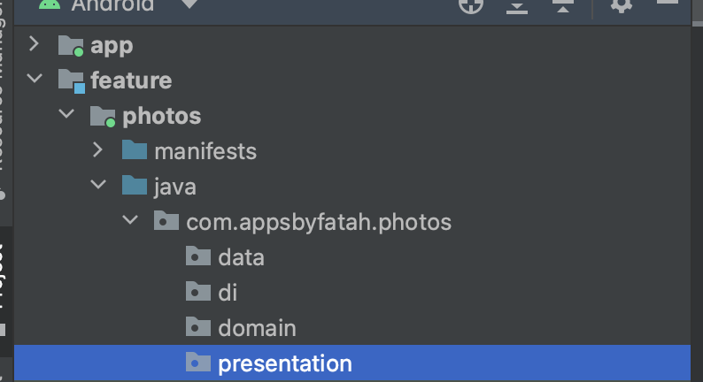
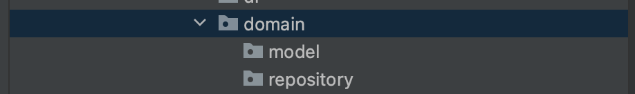
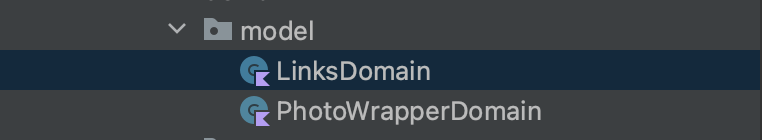
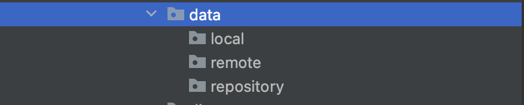

# Feature Modularization Guide

- This is a project to my guide on how to Feature Modularization in Android. I used to love layer modularization
  but I have to come love Feature Modularization.
- Feature Modularization is where you choose an architecture which is multi-module 
(Using additional modules to the default App module). And organizing your modules by features 
of your app.

## Why Feature Modularization

- The right architecture in Android Development can help you write clear code that is easy to write,
maintain, and update easily. It also helps in collaboration keeping in check everyone's
contributions.
- Feature modularization takes this up-notch by focusing on clean-code at Feature level ensuring 
every feature is clean and organized.

### Benefits of Feature Modularization

1. Focus on features - Features are the most important thing to users and by choosing feature 
modularization you are adopting a mindset to give the users your best app. I honestly believe clean code
reflects on the users side as well.
2. Productivity - It's less stressful to find files. Knowing where files are when coding is the main
reason why I dislike layer modularization.
3. Onboarding team members - It's easy to onboard team members since they will just go the module
they are assigned to. Also they can study the code according to features which is more clear and 
concise
4. Allows room for experimentation - Its to experiment on new features and this is a win for companies 
who are always testing new features. You can delete a whole module and get your code working again with just 
a few lines of editing.
5. Dynamic Feature Modules - Reduce app install size and save user storage by dynamic features which
enables features to be downloaded on when needed. This is only possible when you modularize by feature.

### Difference between feature and layer modularization

- You modularize layer modularization by layer (Domain, Data, presentation) and feature 
modularization by app features (e.g. authentication, timeline e.t.c).
- Feature modularization contains layers in every feature module while in layer, layers are 
different modules.

## How to implement feature modularization

- Start by creating your project and picking app name like you would normally do in android studio.
- 
1


- Create a folder called feature. This folder will be used to store all the feature modules. Right 
click on your root folder and navigate to new > Directory and create feature folder.


- Right click on your root folder and navigate to new > module. Create a new module by picking name
in pop up. Also pick no activity in the second pop up.


- Move photos module to feature folder and add :feature before feature name in settings.gradle.kts


## Components of a feature module



- Common/main components of feature module are:
1. Domain package
2. Data Package
3. Dependency Injection/DI package
4. Presentation Package

### 1. Domain Package

- This is used package/layer is used to define the Business logic of the project. 
- These are elements that don't change and define the larger structure of data and interface.
- To pick this package correctly you need to understand your field and break what you want your app
to do to the nitty-gritties.
- e.g. for a BMI(Body Mass Index) app. The stuff that don't change are: <br>
```
1. Height (M)
2. Weight (Kg)
3. Formula (kg/m*m)
 ```
- Domain Module can sub-divided into more packages
1. Model
2. Repository
3. Usecases (If you use usecases they go here, for this project we will not use usecases)
4. and more business logic related packages



#### Model

- Contains models that define the structure of your project. This is defined mostly by the API you are
using or database structure of your local database.
- More things that define and shape your model package are Client requirements, User needs, direction
your company/organization is thinking of going to.
- For this photos module case its defined by API-unsplash that we are using.
([check it out here](https://unsplash.com/documentation))
- Unsplash API endpoint for photos looks like this:

```
[
  {
    "id": "LBI7cgq3pbM",
    "created_at": "2016-05-03T11:00:28-04:00",
    "updated_at": "2016-07-10T11:00:01-05:00",
    "width": 5245,
    "height": 3497,
    "color": "#60544D",
    "blur_hash": "LoC%a7IoIVxZ_NM|M{s:%hRjWAo0",
    "likes": 12,
    "liked_by_user": false,
    "description": "A man drinking a coffee.",
    "user": {
      "id": "pXhwzz1JtQU",
      "username": "poorkane",
      "name": "Gilbert Kane",
      "portfolio_url": "https://theylooklikeeggsorsomething.com/",
      "bio": "XO",
      "location": "Way out there",
      "total_likes": 5,
      "total_photos": 74,
      "total_collections": 52,
      "instagram_username": "instantgrammer",
      "twitter_username": "crew",
      "profile_image": {
        "small": "https://images.unsplash.com/face-springmorning.jpg?q=80&fm=jpg&crop=faces&fit=crop&h=32&w=32",
        "medium": "https://images.unsplash.com/face-springmorning.jpg?q=80&fm=jpg&crop=faces&fit=crop&h=64&w=64",
        "large": "https://images.unsplash.com/face-springmorning.jpg?q=80&fm=jpg&crop=faces&fit=crop&h=128&w=128"
      },
      "links": {
        "self": "https://api.unsplash.com/users/poorkane",
        "html": "https://unsplash.com/poorkane",
        "photos": "https://api.unsplash.com/users/poorkane/photos",
        "likes": "https://api.unsplash.com/users/poorkane/likes",
        "portfolio": "https://api.unsplash.com/users/poorkane/portfolio"
      }
    },
    "current_user_collections": [ // The *current user's* collections that this photo belongs to.
      {
        "id": 206,
        "title": "Makers: Cat and Ben",
        "published_at": "2016-01-12T18:16:09-05:00",
        "last_collected_at": "2016-06-02T13:10:03-04:00",
        "updated_at": "2016-07-10T11:00:01-05:00",
        "cover_photo": null,
        "user": null
      },
      // ... more collections
    ],
    "urls": {
      "raw": "https://images.unsplash.com/face-springmorning.jpg",
      "full": "https://images.unsplash.com/face-springmorning.jpg?q=75&fm=jpg",
      "regular": "https://images.unsplash.com/face-springmorning.jpg?q=75&fm=jpg&w=1080&fit=max",
      "small": "https://images.unsplash.com/face-springmorning.jpg?q=75&fm=jpg&w=400&fit=max",
      "thumb": "https://images.unsplash.com/face-springmorning.jpg?q=75&fm=jpg&w=200&fit=max"
    },
    "links": {
      "self": "https://api.unsplash.com/photos/LBI7cgq3pbM",
      "html": "https://unsplash.com/photos/LBI7cgq3pbM",
      "download": "https://unsplash.com/photos/LBI7cgq3pbM/download",
      "download_location": "https://api.unsplash.com/photos/LBI7cgq3pbM/download"
    }
  },
  // ... more photos
]
```

All we need is photos so we won't use all this and just break it down to id and photos.

```
[
  {
    "id": "LBI7cgq3pbM",
    "urls": {
      "raw": "https://images.unsplash.com/face-springmorning.jpg",
      "full": "https://images.unsplash.com/face-springmorning.jpg?q=75&fm=jpg",
      "regular": "https://images.unsplash.com/face-springmorning.jpg?q=75&fm=jpg&w=1080&fit=max",
      "small": "https://images.unsplash.com/face-springmorning.jpg?q=75&fm=jpg&w=400&fit=max",
      "thumb": "https://images.unsplash.com/face-springmorning.jpg?q=75&fm=jpg&w=200&fit=max"
    },
  }
]
```
We can create 2 models from this:
1. Links
2. Wrapper with ID



```
data class LinksDomain(
    val raw: String,
    val full: String,
    val regular: String,
    val small: String,
    val thumb: String
)
```

```
data class PhotoWrapperDomain(
    val id: String,
    val urls: LinksDomain
)
```

#### Repository

- This is an interface to connect domain package to other packages. Specifically in this case data 
and presentation. it acts as bridge between the two


- Inside the repository we declare what functionalities of the features we want to create. e.g. in
our getPhotos to get a list of photos.

```
interface PhotosRepository {
    suspend fun getPhotos(): Flow<ResultWrapper<List<PhotoWrapperDomain>>>
}
```

- we are using flow from coroutine libraries and making it a suspend function to make it easier to
work on with in the main thread
- ResultWrapper is created in Common (a shared repository). Implementation of Common module is down
below.

### 2. Data package

### 3. Dependency Injection (DI) package
### 4. Presentation Package