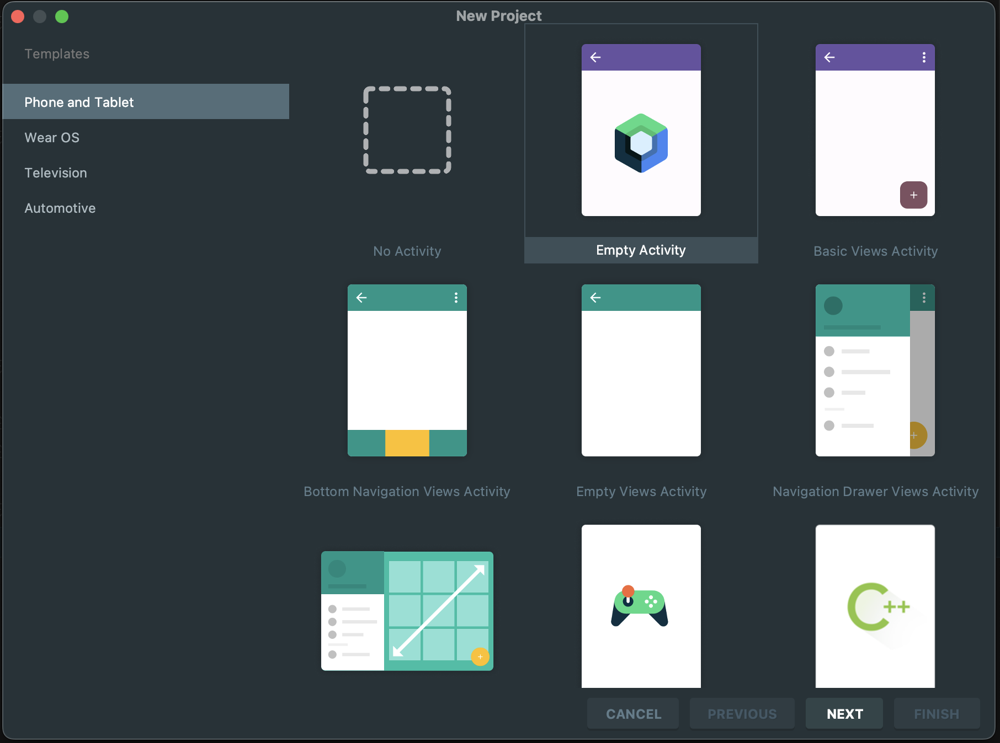
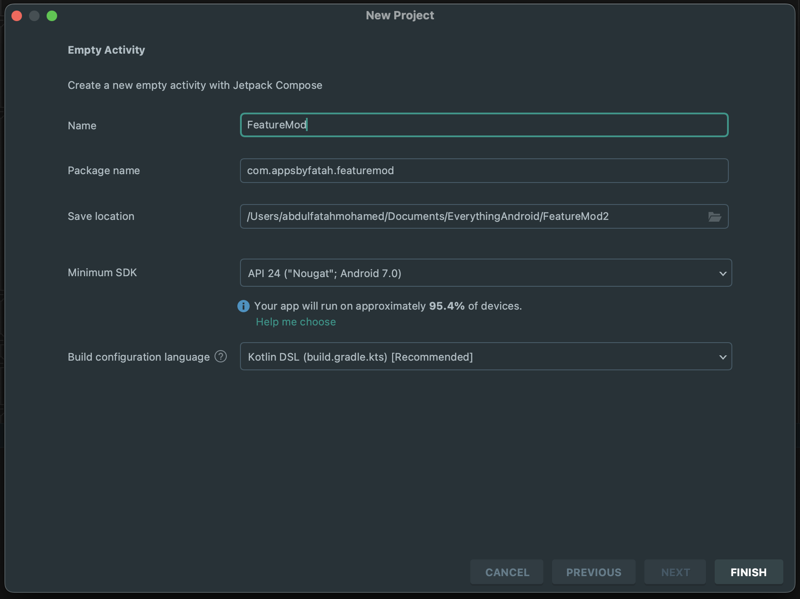
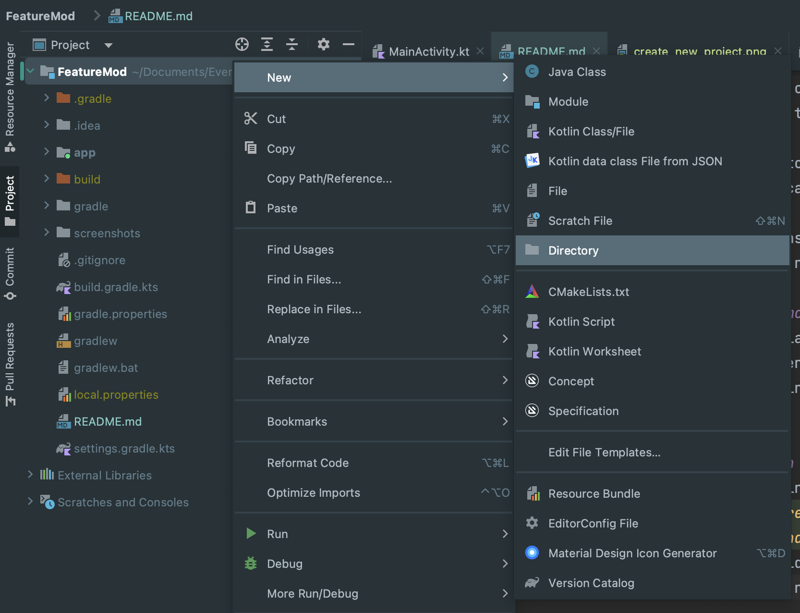
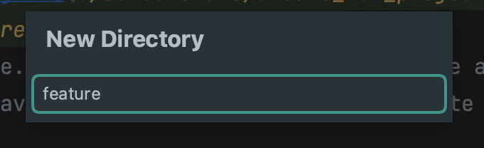
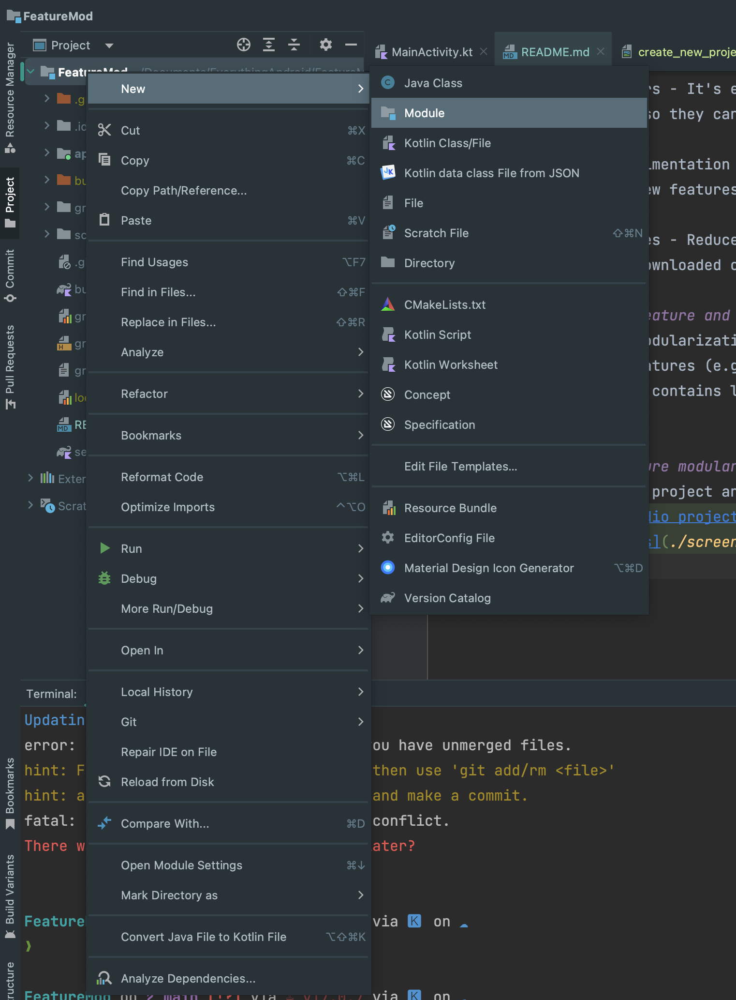
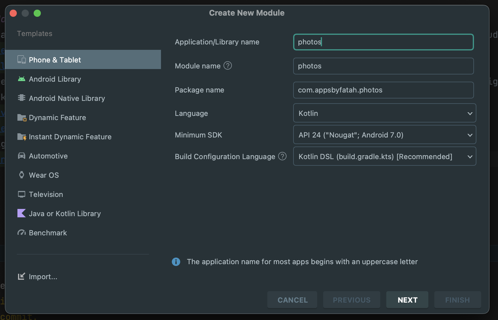
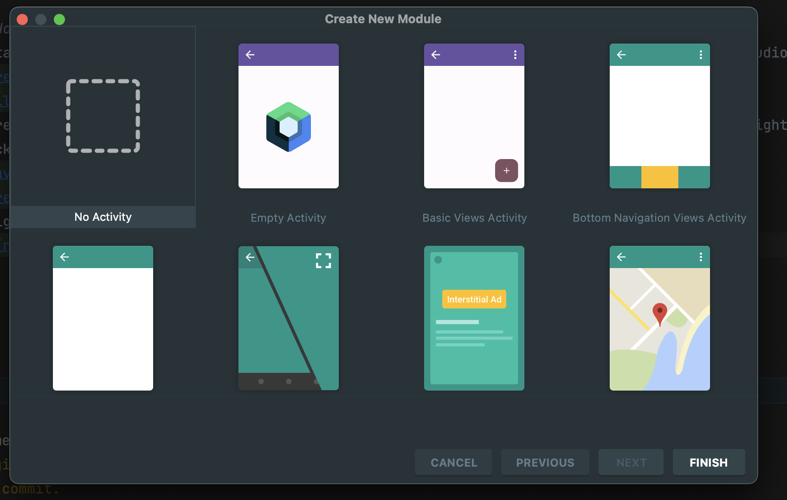
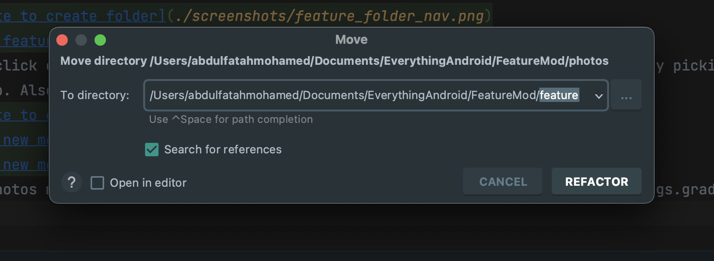
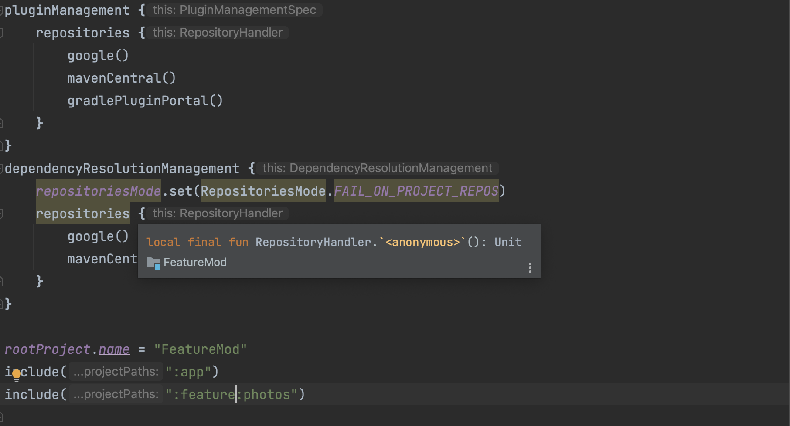

# Feature Modularization Guide
- This is a project to my guide on how to Feature Modularization in Android. I used to love layer modularization
  but I have to come love Feature Modularization.
- Feature Modularization is where you choose an architecture which is multi-module 
(Using additional modules to the default App module). And organizing your modules by features 
of your app.

## Why Feature Modularization
- The right architecture in Android Development can help you write clear code that is easy to write,
maintain, and update easily. It also helps in collaboration keeping in check everyone's
contributions.
- Feature modularization takes this up-notch by focusing on clean-code at Feature level ensuring 
every feature is clean and organized.

### Benefits of Feature Modularization
1. Focus on features - Features are the most important thing to users and by choosing feature 
modularization you are adopting a mindset to give the users your best app. I honestly believe clean code
reflects on the users side as well.
2. Productivity - It's less stressful to find files. Knowing where files are when coding is the main
reason why I dislike layer modularization.
3. Onboarding team members - It's easy to onboard team members since they will just go the module
they are assigned to. Also they can study the code according to features which is more clear and 
concise
4. Allows room for experimentation - Its to experiment on new features and this is a win for companies 
who are always testing new features. You can delete a whole module and get your code working again with just 
a few lines of editing.
5. Dynamic Feature Modules - Reduce app install size and save user storage by dynamic features which
enables features to be downloaded on when needed. This is only possible when you modularize by feature.

### Difference between feature and layer modularization
- You modularize layer modularization by layer (Domain, Data, presentation) and feature 
modularization by app features (e.g. authentication, timeline e.t.c).
- Feature modularization contains layers in every feature module while in layer, layers are 
different modules.

## How to implement feature modularization
- Start by creating your project and picking app name like you would normally do in android studio.

- Create a folder called feature. This folder will be used to store all the feature modules. Right 
click on your root folder and navigate to new > Directory and create feature folder.

- Right click on your root folder and navigate to new > module. Create a new module by picking name
in pop up. Also pick no activity in the second pop up.

- Move photos module to feature folder and add :feature before feature name in settings.gradle.kts

